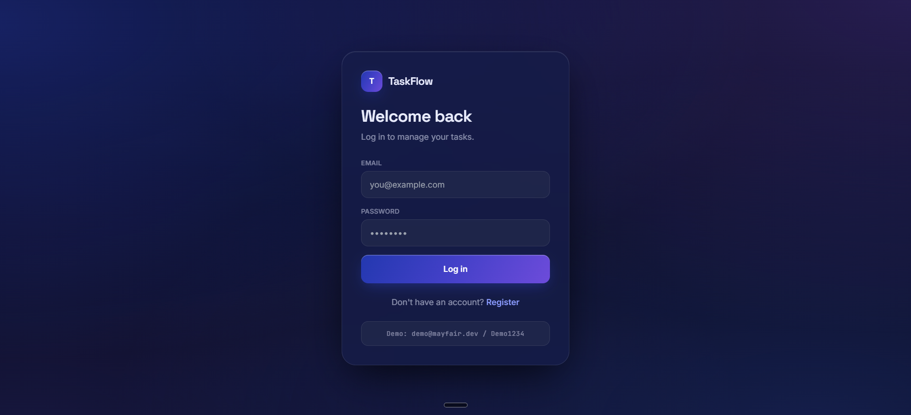
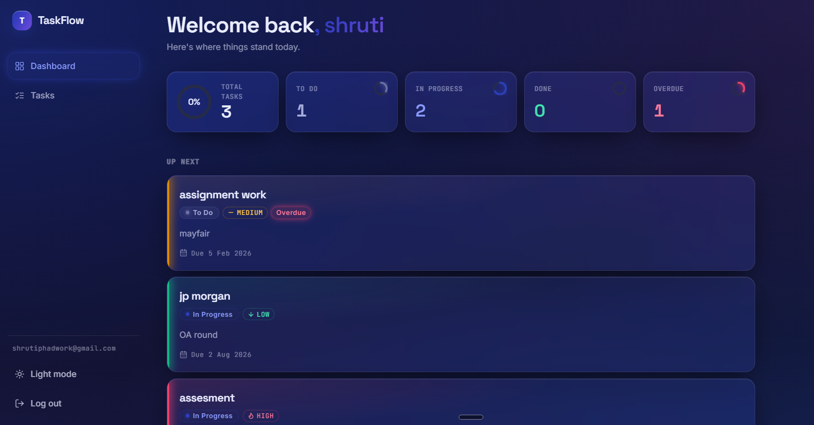
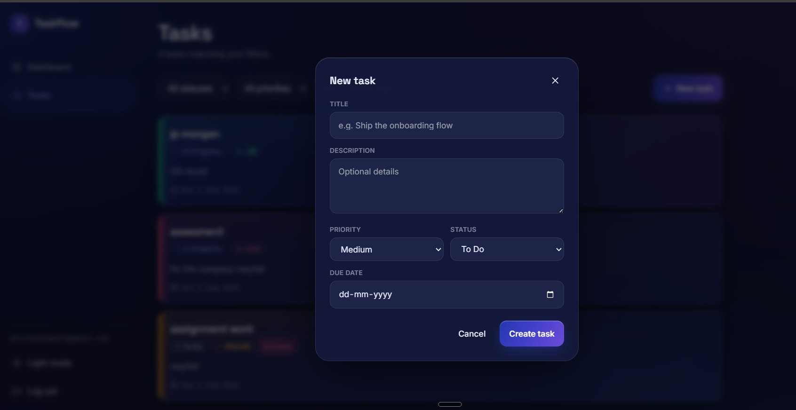

# TaskFlow — Full-Stack Task Management Application

A production-quality task management application built for the **Mayfair Worktops Full Stack Developer** assignment. Users register, log in, and manage personal tasks with full CRUD, filtering, sorting, and a summary dashboard — behind JWT-based authentication with per-user data isolation.

**Live demo:** https://task-flow-mayfair.vercel.app
**Demo login:** `demo@mayfair.dev` / `Demo1234`

> **AI tool disclosure (per the assignment):** built with Claude (Anthropic) as a pair-programming assistant. Every design decision and line of code is one I can explain in a follow-up interview.

---

## 1. Overview

TaskFlow is a full-stack solution with a **clear separation between frontend and backend** — a React single-page app talking to a standalone Express REST API over HTTP, with no shared runtime. Authentication is stateless (JWT); every request re-verifies identity, and every task query is scoped to its owner so no user can ever access another user's data.

| | |
|---|---|
| **Frontend (Vercel)** | https://task-flow-mayfair.vercel.app |
| **Backend API (Render)** | `<FILL IN: https://your-backend.onrender.com>` |
| **Database** | PostgreSQL (Render managed Postgres) |

---

## 2. Tech stack

| Layer | Choice | Why |
|---|---|---|
| Frontend | React 18 + Vite | Fast dev/build; keeps the client/backend boundary explicit (no folded-in API) |
| State | React Context (auth, theme) + Zustand (tasks) | Context for rarely-changing global state; Zustand for the task list to avoid re-render churn on every filter/sort |
| Styling | Tailwind CSS | Utility-first, consistent design system, built-in dark mode |
| Forms / validation | React Hook Form + Zod | Declarative client-side validation mirroring the server rules |
| Backend | Node.js + Express | RESTful API with middleware-based auth, validation, and error handling |
| Database | PostgreSQL + Sequelize ORM | Relational integrity for the user->tasks relationship, real indexes, enum types for priority/status |
| Auth | JWT (stateless) + bcrypt | Token-based auth; passwords hashed, never stored in plaintext |
| Deployment | Vercel (frontend) + Render (backend + Postgres) | Standard MERN/PERN split-deployment pattern |

This is a **PERN**-style app (Postgres/Express/React/Node) — the SQL option the brief explicitly allows — deliberately kept as two separate `/client` and `/server` projects.

---

## 3. Features

**Authentication**
- Registration with email + password validation
- JWT-based login; protected routes (dashboard/tasks are inaccessible when logged out)
- Logout that clears the session token

**Task management (CRUD)**
- Create tasks with title (required), description, priority (Low/Medium/High), due date, and status (To Do / In Progress / Done)
- View all of the logged-in user's tasks, **filter** by status and priority, **sort** by due date or creation date
- Edit any field; delete with a confirmation prompt

**Dashboard**
- Total tasks, a breakdown grouped by status, and an overdue count — aggregated in the database, not on the client
- Colour-coded priority badges and status indicators

**UX / polish**
- Responsive, mobile-friendly layout
- Client-side form validation
- Dark mode toggle (bonus)

---

## 4. Screenshots

| Login | Dashboard | Create task |
|---|---|---|
|  |  |  |

> Save the three uploaded screenshots into a `docs/` folder as `screenshot-login.png`, `screenshot-dashboard.png`, and `screenshot-new-task.png` so these render on GitHub.

---

## 5. Project structure

```
taskflow/
├── client/                     # React + Vite frontend
│   └── src/
│       ├── api/                 # axios instance (JWT interceptors) + API wrappers
│       ├── context/             # AuthContext, ThemeContext
│       ├── store/               # Zustand task store
│       ├── components/          # Navbar, TaskCard, TaskFormModal, FilterSortBar, etc.
│       └── pages/               # Login, Register, Dashboard, Tasks
├── server/                      # Express + PostgreSQL backend
│   ├── src/
│   │   ├── config/               # Sequelize connection
│   │   ├── models/               # User, Task (schemas, associations, indexes)
│   │   ├── middleware/           # auth, validation, centralized error handling
│   │   ├── controllers/          # auth, task, dashboard
│   │   ├── routes/
│   │   └── utils/                # JWT + asyncHandler helpers
│   ├── seed/                     # demo user + sample tasks
│   └── tests/                    # Jest + Supertest integration tests
├── .github/workflows/ci.yml      # GitHub Actions CI
├── docker-compose.yml            # one-command local startup
└── ARCHITECTURE.md               # design decisions & trade-offs
```

---

## 6. Local setup

### Prerequisites
- Node.js 20+
- PostgreSQL 14+ running locally

### Backend
```bash
cd server
cp .env.example .env          # fill in DB_* values, JWT_SECRET, CLIENT_ORIGIN
npm install
npm run seed                   # optional: creates demo user + 8 sample tasks
npm run dev                    # http://localhost:5000
```

### Frontend
```bash
cd client
cp .env.example .env           # set VITE_API_URL=http://localhost:5000/api
npm install
npm run dev                    # http://localhost:5173
```

Log in with the seeded demo account: `demo@mayfair.dev` / `Demo1234`.

### One-command startup (Docker)
```bash
docker compose up --build      # starts Postgres + backend + frontend together
```

---

## 7. Environment variables

**server/.env**
| Variable | Description |
|---|---|
| `PORT` | Server port (default 5000) |
| `NODE_ENV` | `development` / `production` / `test` |
| `DB_HOST`, `DB_PORT`, `DB_NAME`, `DB_USER`, `DB_PASSWORD` | Postgres connection details (local dev) |
| `DATABASE_URL` | Single connection string; if set, overrides the discrete `DB_*` vars (used by Render's managed Postgres) |
| `JWT_SECRET` | Secret for signing JWTs — a long random string |
| `JWT_EXPIRES_IN` | Token lifetime, e.g. `7d` |
| `CLIENT_ORIGIN` | Comma-separated allowed CORS origins (e.g. the Vercel URL in production) |

**client/.env**
| Variable | Description |
|---|---|
| `VITE_API_URL` | Base URL of the backend API, e.g. `http://localhost:5000/api` (or the Render URL in production) |

---

## 8. API reference

All routes are prefixed with `/api`. Protected routes require `Authorization: Bearer <token>`.

### Auth
| Method | Route | Auth | Body | Notes |
|---|---|---|---|---|
| POST | `/auth/register` | – | `{ name, email, password }` | password >= 8 chars, >= 1 digit; returns `{ token, user }` |
| POST | `/auth/login` | – | `{ email, password }` | returns `{ token, user }` |
| GET | `/auth/me` | yes | – | returns the current user; re-validates a stored token on app load |
| POST | `/auth/logout` | yes | – | stateless — client discards the token |

### Tasks
| Method | Route | Auth | Notes |
|---|---|---|---|
| GET | `/tasks?status=&priority=&sortBy=&order=` | yes | `status`: `todo\|in_progress\|done`; `priority`: `low\|medium\|high`; `sortBy`: `due_date\|created_at`; `order`: `asc\|desc` |
| GET | `/tasks/:id` | yes | 404 if the task isn't the caller's |
| POST | `/tasks` | yes | `{ title, description?, priority?, status?, due_date? }` |
| PUT | `/tasks/:id` | yes | any subset of the same fields |
| DELETE | `/tasks/:id` | yes | confirmation handled client-side |

### Dashboard
| Method | Route | Auth | Returns |
|---|---|---|---|
| GET | `/dashboard/summary` | yes | `{ total, byStatus: { todo, in_progress, done }, overdue }` |

**Status codes:** `200/201` success, `400` validation, `401` auth, `404` not found, `409` conflict (duplicate email), `500` unexpected. All errors follow `{ message, errors? }`.

---

## 9. Database design

Two tables with a one-to-many relationship (`users` -> `tasks`):
- **UUID** primary keys (don't leak record counts/order)
- **ENUM** types for `priority` and `status` (DB-level constraints)
- `due_date` as `DATE` (no time component — avoids timezone bugs in overdue checks)
- Foreign key `tasks.user_id -> users.id` with `ON DELETE CASCADE`
- **Indexes** on `user_id`, `status`, `priority`, `due_date`, plus a composite `(user_id, status, due_date)` covering the most common query shape

Full rationale (schema, auth flow, trade-offs) is in **ARCHITECTURE.md**.

---

## 10. Testing

```bash
cd server && npm test
```
Integration tests using **Jest + Supertest** against a **real PostgreSQL database** (not mocks), covering registration, login, weak-password rejection, full task CRUD, filtering, and — critically — **ownership isolation** (an automated test proving one user cannot read, edit, or delete another user's tasks) and dashboard aggregation.

---

## 11. CI/CD

**GitHub Actions** (`.github/workflows/ci.yml`) runs on every push and pull request:
- Spins up a PostgreSQL service container and runs the full backend test suite against it
- Installs the frontend and runs a production build

A red pipeline blocks broken code from merging.

---

## 12. Deployment

- **Frontend -> Vercel:** connect the repo, set root to `client/`, add `VITE_API_URL` pointing at the Render backend URL.
- **Backend -> Render:** Web Service from `server/`, provision a Render PostgreSQL instance, set `DATABASE_URL` + `JWT_SECRET` + `CLIENT_ORIGIN` (the Vercel URL). `sequelize.sync()` creates the schema on first boot; run the seed script once if you want demo data.

---

## 13. Design decisions & trade-offs

See **ARCHITECTURE.md** for the full write-up. In brief: JWT is stored in `localStorage` for a simpler cross-origin setup (documented as a production hardening item vs. httpOnly cookies), and `sequelize.sync` is used in place of versioned migrations for this scope (migrations would replace it for a real production rollout).
